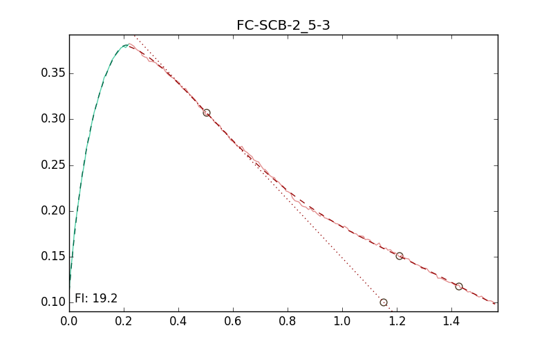

# scb_helper
Function to calculate variables for the illinois flexibility test (A.K.A. IFIT, SCB, Semi-Circular Bend, etc.). Function is specific to a proprietary output csv but could be reworked for comma-separated text files containing load-displacement data from other sources.
The function takes a path to the csv file and returns all calculated parameters from AASHTO T 105, the standard method for measurement of Fracture Energy and Illinois Fracture Index of an asphalt mixture.

Also includes matplotlib function to visually check calculations. Below is the end result, with parameters like Critical Displacement and inflection points on the falling load line marked. The fracture index is labeled in the bottom left.

